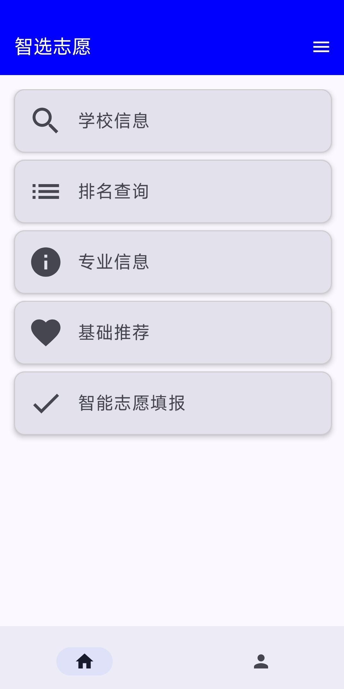
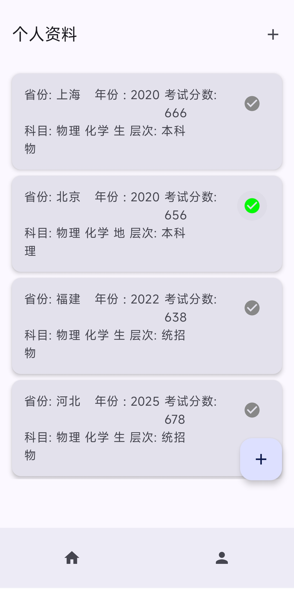
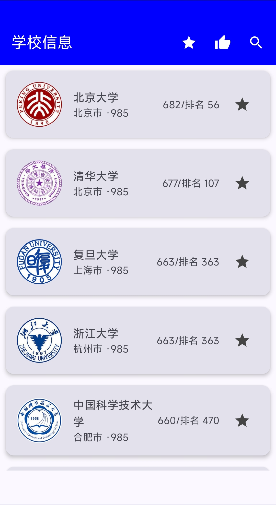
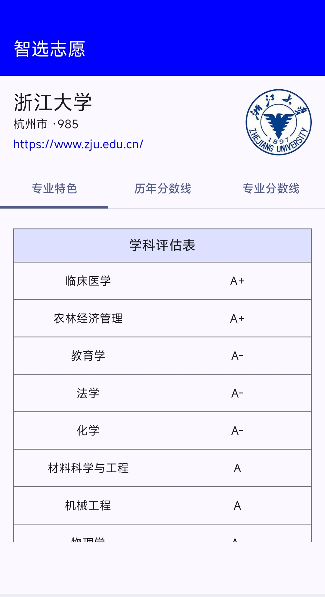
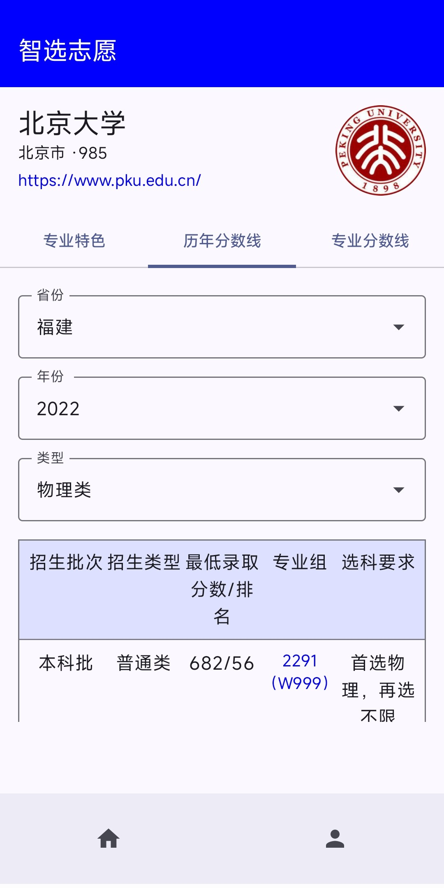
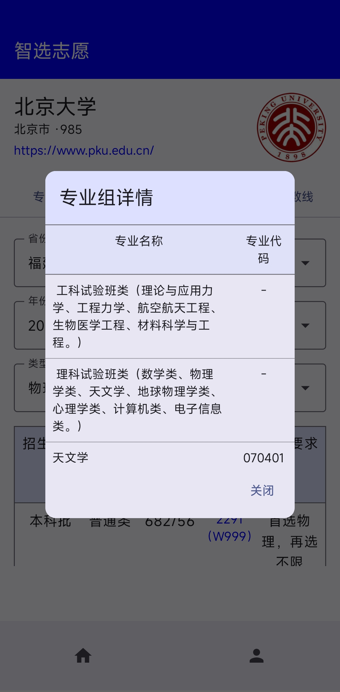
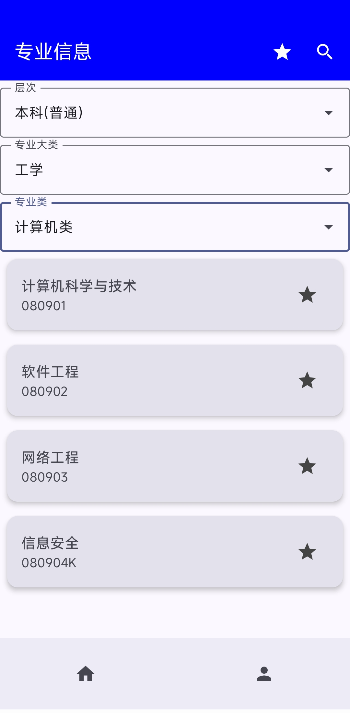
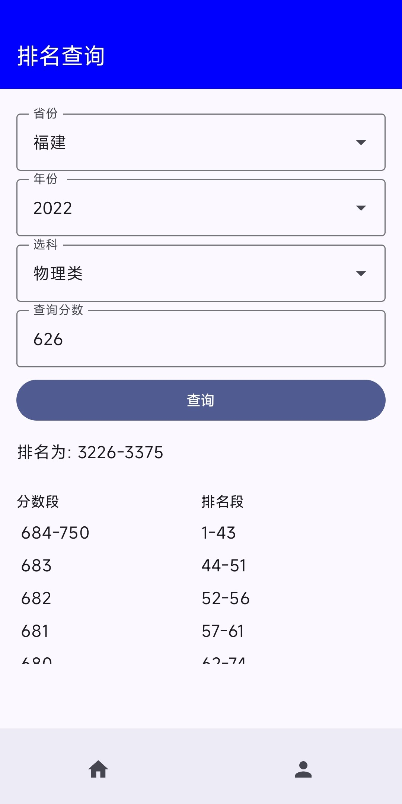
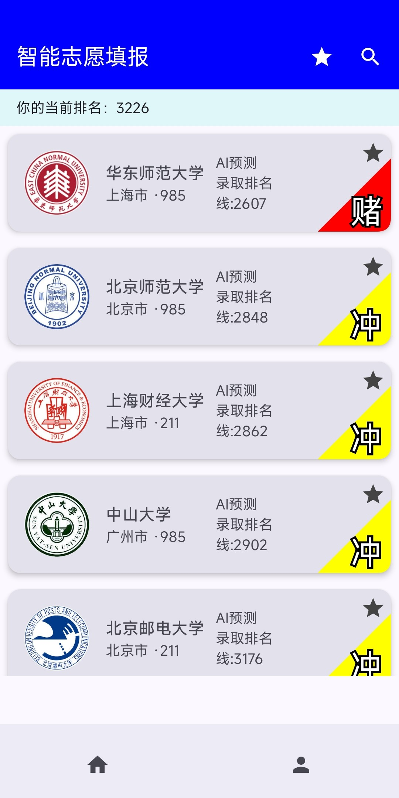

<!-- 文件：README.md -->
[中文](README.md) | [English](README_en.md)

# 智选志愿（IntelliZhiyuan）

## 简介
智选志愿（IntelliZhiyuan）是一款基于 Android 平台的高考志愿填报辅助工具。  
应用汇集了众多院校及专业数据，结合多因子模型与时序预测算法，帮助考生进行精准的志愿决策。  
支持个人档案管理、历史分数线与排名查询、智能推荐与社交化推荐（可选），致力于提升填报效率与成功率。

## 主要功能
1. **个人信息**  
   - 创建和切换多个用户档案  
   - 自动填充分数、排名等查询条件

2. **学校信息**  
   - 查看院校专业特色与招生简章  
   - 历年分数线与排名查询  
   - 专业分数线与排名查询  
   - 收藏心仪院校

3. **排名查询**  
   - 根据分数计算在各省市的名次范围

4. **专业信息**  
   - 按专业名称或类别快速检索

5. **基础推荐**  
   - 基于用户分数匹配历史录取分数线最接近的院校

6. **智能志愿填报**  
   - 基于历史录取数据、专业特色等多因子训练的 TFT（Temporal Fusion Transformer）时序模型  
   - 智能预测 2025 年各校最低录取排名线  
   - 根据用户档案排名，推荐排名接近的院校

7. **社交化推荐（可选）**  
   - 需部署后端 Spring Boot 服务 `favorite-service`  
   - 用户收藏同步至服务器，实现基于用户相似度的社交化推荐

## 构建环境
- Android Studio + Gradle  
- Kotlin + Jetpack Compose + Room 数据库  
- （可选）后端：Maven + Spring Boot 2.7+

## 构建提示
1. 克隆并初始化子模块：  
   ```bash
   git submodule update --init --recursive
2. 若使用 favorite-service，请在 network/NetworkModule.kt 中将 BASE 修改为后端实际部署地址。

## 已知问题
- 初次加载学校详细信息时，数据处理过程等待时间较长

## 截图








