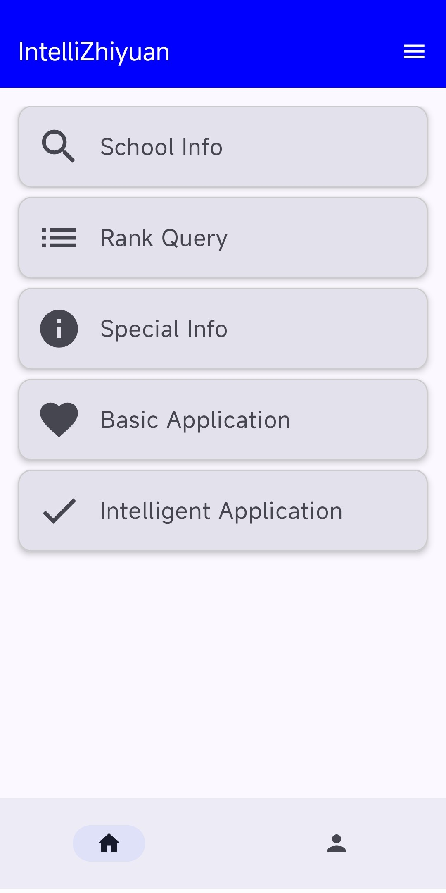

<!-- 文件：README_en.md -->
[中文](README.md) | [English](README_en.md)

<h1 align="center">
  
  <br>IntelliZhiyuan<br>
</h1>

## Introduction
IntelliZhiyuan is an Android application designed to assist Chinese college-entrance exam candidates in selecting and submitting their university choices.  
It integrates extensive school and major datasets with multi-factor models and temporal forecasting algorithms to deliver precise recommendations.  
Features include user profile management, historical score and rank lookup, intelligent prediction, and optional collaborative recommendations—aimed at improving decision-making efficiency and admission success rate.

## Key Features
1. **Profile Management**  
   - Create and switch between multiple user profiles  
   - Auto-fill score and rank fields for lookups

2. **School Information**  
   - View majors’ highlights and admission brochures  
   - Lookup historical cut-off scores and ranks  
   - Lookup major-specific cut-off scores and ranks  
   - Favorite desired universities

3. **Rank Lookup**  
   - Calculate expected ranking in various provinces based on score

4. **Major Directory**  
   - Search majors quickly by name or category

5. **Basic Recommendation**  
   - Recommend universities whose historical cut-off scores closely match the user’s score

6. **Intelligent Recommendation**  
   - Employs a Temporal Fusion Transformer (TFT) model trained on historical admission data and major features  
   - Forecasts minimum admission rank thresholds for 2025  
   - Suggests best-fit schools based on user ranking

7. **Collaborative Recommendation (Optional)**  
   - Requires deployment of the Spring Boot `favorite-service` backend  
   - Syncs user favorites to the server and generates recommendations based on community similarity

## Environment
- Android Studio (Arctic Fox or later) + Gradle  
- Kotlin + Jetpack Compose + Room  
- (Optional) Backend: Maven + Spring Boot 2.7+

## Build Notes
1. Clone and initialize submodules(databases):  
   ```bash
   git clone --recurse-submodules https://github.com/HongLanx/IntelliZhiyuan.git
2. If using favorite-service, update the BASE_URL in network/NetworkModule.kt to your backend endpoint.

## Known Issues
1. Loading time is too long when load the detailed info of a school for the first time.

## Screenshots



